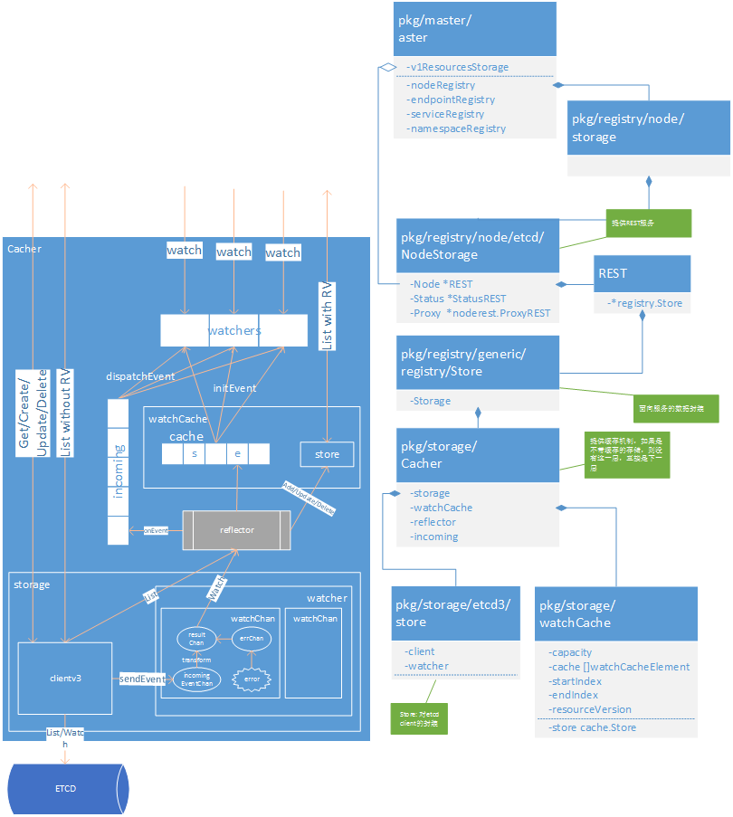

# APIServer


## 0.关键调用堆栈：

```go
func New(c *Config) (*Master, error)
..func (m *Master) InstallAPIs(c *Config)
....func (m *Master) initV1ResourcesStorage(c *Config)
......xxxStorage := xxxetcd.NewStorage(...)
....func (s *GenericAPIServer) InstallAPIGroups(groupsInfo []APIGroupInfo) error
......func (s *GenericAPIServer) installAPIGroup(apiGroupInfo *APIGroupInfo) error
func (s *GenericAPIServer) Run(options *ServerRunOptions)
..secureServer.ListenAndServeTLS()
..http.ListenAndServe()
```

##1.资源storage

```go
func (m *Master) initV1ResourcesStorage(c *Config) {
    podStorage := podetcd.NewStorage(...)
    ...
    m.v1ResourcesStorage = map[string]rest.Storage{
		"bindings":         podStorage.Binding,
    }
}

func NewStorage(...) PodStorage {
	storageInterface, _ := opts.Decorator(...)  // 由Decorator生成storage
	store := &registry.Store{
		...
		Storage: storageInterface,
	}

	return PodStorage{
		Binding:     &BindingREST{store: store},
	}
}
```

在上面的方法中，storage是由Decorator这装饰器生成的。装饰有两种，一种是带缓存的(StorageWithCacher)，另一种是不带缓存的(UndecoratedStorage)。前者比后者多了一层缓存封装。如下。

```go
	if c.EnableWatchCache {
		s.storageDecorator = registry.StorageWithCacher
	} else {
		s.storageDecorator = generic.UndecoratedStorage
	}

func StorageWithCacher(...) {
	cacher := storage.NewCacherFromConfig(cacherConfig)
	return cacher, destroyFunc
}

func UndecoratedStorage(...) {
	return NewRawStorage(config)
}
```




 

